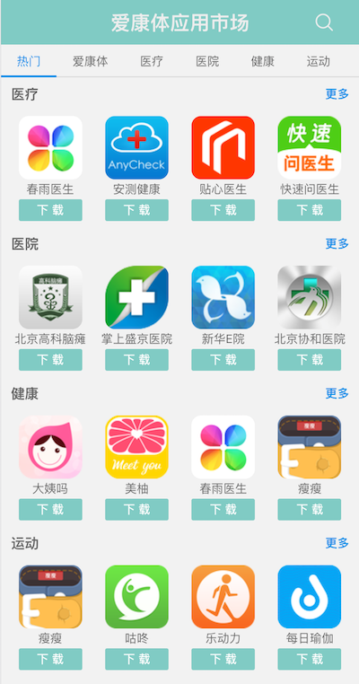

健康云服务前端（移动端）
===========

[爱康体项目介绍](http://cdnst.icontinua.com/html/intro.html)

## 主要功能
- 体检报告历史查询和趋势分析
- 身体基础数据、血压、血氧、生物电详细测量结果、分析建议、用户排名
- 个人信息的编辑与修改
- 化验单上传识别
- 健康APP商店: http://icontinua.com/apps

## 相关内容
- gulp: javascript项目管理工具
- React.js:
    + ant.design: React组件库
    + react-router: 页面路由
- webpack: 编译打包工具
- npm: nodejs包管理
- stylus: CSS预编译
- pug(jade): HTML模板
- ECMASCRIPT 2015 / ECMASCRIPT 7, babeljs
    - fetch API
    - Promise API 
- echarts: 图表绘制
- standard: 代码检查工具
- uglifyjs, cleancss: 代码混淆和压缩 

## 兼容性
- Android 4.0+
- iOS 6.0+

## 相关脚本
- 编译(除三方库): `gulp build`
- 完整编译: `gulp`
- 实时预览: `gulp watch`
- 代码审查: `npm run lint`
- 自动修正代码样式: `npm run fix`
- 部署到苏州开发机: `./deploy-dev.sh`
- 部署到阿里云: `./deploy-production.sh`

## 页面示例
- 体检报告列表

- 身体基础数据报告

- 血压报告

- 血氧报告

- 生物电报告

- 趋势分析

- 个人中心

- 化验单上传

- 化验单解读

- 应用商店

